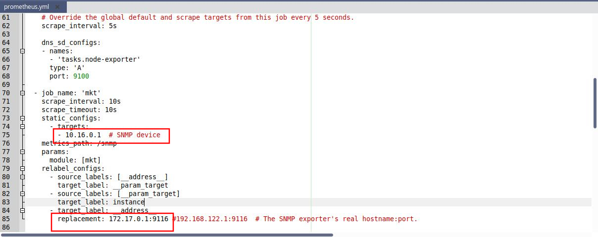
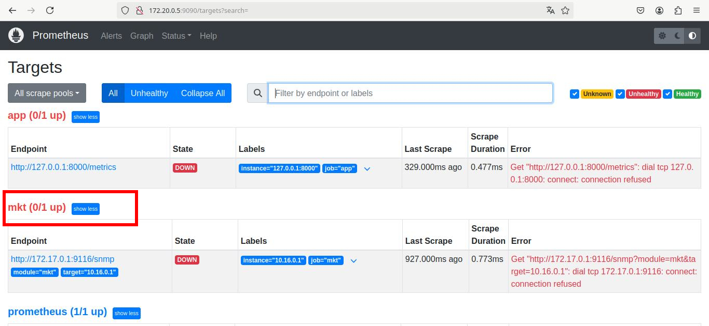
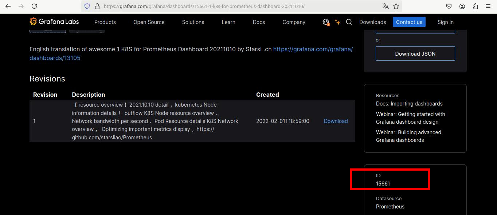
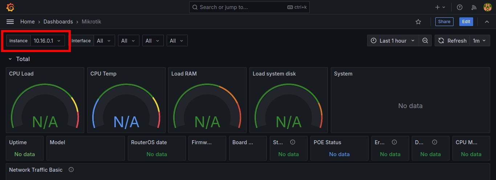

# Pasos para poder visualizar las métricas en un dashboard de grafana

1. Habilitar SNMP en el MKT-328 para poder extraer datos. Para esto ingresar al equipo mikrotik y dirigirse a 
*IP Address/snmp/enable*

### Nota:
*Grafana tiene que tener acceso a Internet para poder descargar archivos al momento de iniciar.*
*Para eso el mkt328 debe tener acceso a internet y ser servidor de dhcp y dns.*

2. Modificar el archivo _prometheus.yml_ y colocar la direccion IP de nuestro router 10.16.0.1. Esto se ve en la linea que dice
 _nombre de trabajo "mkt"/dispositivo SNMP_. Luego, en _"replacement"_ colocar la dirección IP del contenedor de prometheus. Por ej: 172.24.0.1:9116



3. Docker Compose ==> Permite administrar varios contenedores desde el mismo archivo.
Ejecutar docker compose. Ir a donde este el archivo docker-compose.yml y escribir en una Terminal de Linux:
```bash
docker compose up -d 
```
El `-d` es para que se ejecute en segundo plano, sino lo ponemos se queda ejecutando en la terminal.

4. Ir a donde tengamos snmp_exporter, entrar en modo super usuario con `sudo su` y ejecutar `./snmp_exporter`

5. Una vez hecho esto, abrir un navegador web, ir a la dirección IP de prometheus con su puerto correspondiente. Para eso se puede ir a Portainer y ver su la IP del contenedor 
y el puerto es el 9090 en este caso. Esto nos abrirá prometheus. En "Status/Target" debemos ver el mkt en up.


6. Ahora abrir grafana. Para esto ir a la dirección IP del contenedor grafana y el puerto 3000.

7. Ir a Dashboard y en "New/Import" colocar la ID del dashboard que queramos utilizar.
Las ID se pueden ver en la página de grafana, para ver dashboards ir al siguiente [enlace](https://grafana.com/grafana/dashboards/?search=prometheus).
Una vez seleccionado le damos a "Load" y después a "Import" más abajo.

Después en nuestras Dashboards vamos a tener las que hayamos importado, entramos a una, por ejemplo a "Mikrotik" y en la parte superior colocamos la 
dirección IP del router que queremos visualizar, por ejemplo 10.16.0.1. Con esto ya tendríamos que poder visualizar todas las métricas del mikrotik.


