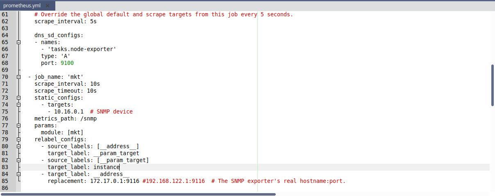

# Pasos para poder visualizar las métricas en un dashboard de grafana

1. Habilitar SNMP en el MKT-328 para poder extraer datos. Para esto ingresar al equipo mikrotik y dirigirse a 
*IP Address/snmp/enable*

### Nota:
*Grafana tiene que tener acceso a Internet para poder descargar archivos al momento de iniciar.*
*Para eso el mkt328 debe tener acceso a internet y ser servidor de dhcp y dns.*

2. Docker Compose ==> Permite administrar varios contenedores desde el mismo archivo.

3. Modificar el archivo _prometheus.yml_ y colocar la direccion IP de nuestro router 10.16.0.1. Esto se ve en la linea que dice
 _nombre de trabajo "mkt"/dispositivo SNMP_. Luego, en _"replacement"_ colocar la dirección IP del contenedor de prometheus. Por ej: 172.24.0.1:9116

4. 

